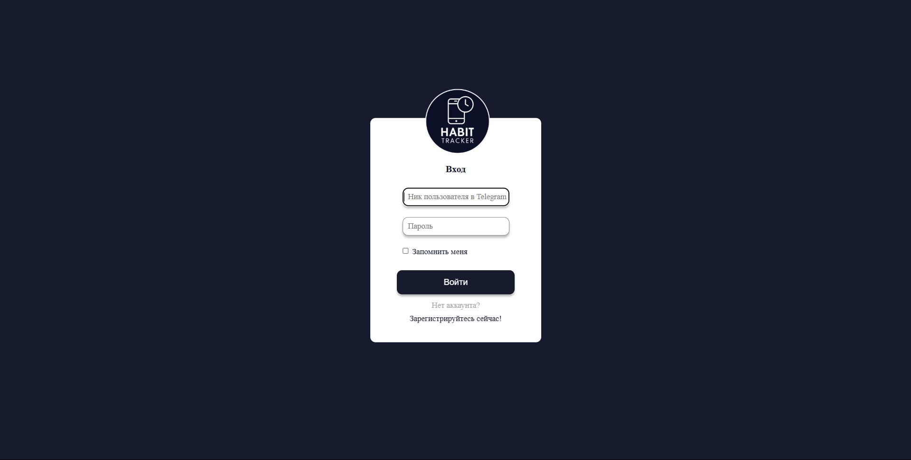

# Финальный проект

Финальный проект по питону: сайт Habit-Tracker!

Проект делали:

- Жуков Ростислав Сергеевич (465898)
  - Backend: База данных и модели
- Каюков Тимофей Артёмович (466148)
  - Unit-тесты и документация
- Шарипов Инсаф Динарович (468065)
  - Frontend
- Панасюк Иван Александрович (405673)
  - Backend: хендлеры
- Кондратьев Иван Александрович (466249)
  - Backend: хендлеры

### Для запуска программы выполнить:

1. Клонировать проект
```bash
git clone https://github.com/zhukovrost/itmo_python_project && cd itmo_python_project
```

2. Создать Venv

Для Mac и Linux
```bash
python3 -m venv venv && source venv/bin/activate
```

Для Windows
```bash
python3 -m venv venv && source venv/scripts/activate
```

3. Установить зависимости
```bash
pip3 install -r requirements.txt
```

4. Запустить программу
```bash
python3 -m flask run
```

5. Перейдите на [localhost:5000](localhost:5000)

Вот что Вы должны увидеть:



### Запуск тестов

1. Установить зависимости для unit-тестов
```bash
pip3 install -r requirements-unit.txt
```

2. Запустить тесты
```bash
python -m pytest unit_test/
```
